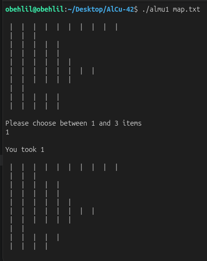

# AlCu-42

AlCu is a terminal game based on heaps of items (rendered as `|`). You play against an AI and alternate removing items from the current heap. The goal is to avoid taking the very last item of the game.

---

## Screenshot



Example gameplay in the terminal.

---

## Rules

- The board is a list of heaps (one heap per line).
- Only the **current heap** is active: the last non-empty heap.
- On your turn, you must remove **1 to 3** items from the current heap.
- When a heap reaches zero, play moves to the previous heap.
- **If you take the last remaining item of the last heap, you lose.**

The AI uses a simple modulo strategy for each heap, so expect it to play optimally within a heap.

## Build

```sh
make
```

This produces a binary named `almu1` (legacy name defined in the Makefile). If you want a different name, update the `NAME` variable in the Makefile.

## Run

You can provide a map file, or enter the map through standard input.

```sh
./almu1 path/to/map.txt
```

or

```sh
./almu1
```

### Map format

- One positive integer per line (heap size).
- An empty line ends the map.

Example `map.txt`:

```
3
5
2
```

## Gameplay

1. The board is printed as rows of `|`.
2. When prompted, enter a number between **1 and 3**.
3. The AI replies with its move.
4. Play continues until the last item is taken (the player who takes it loses).